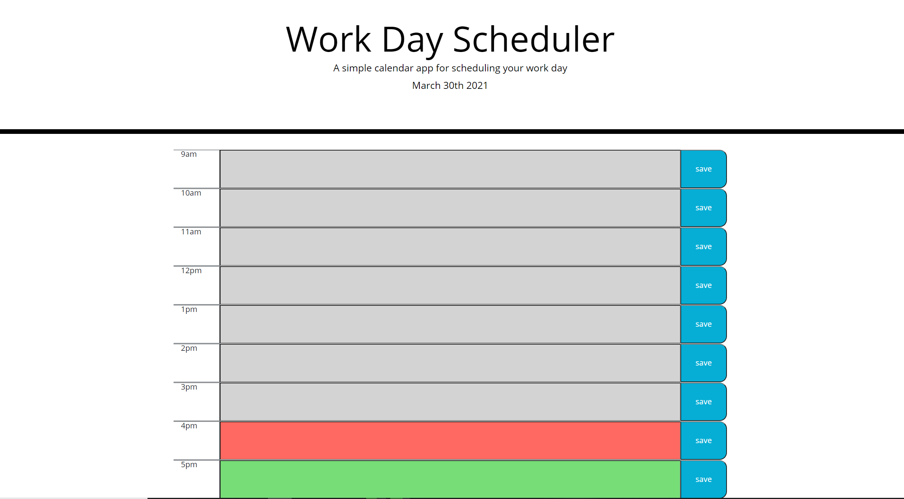

Author: Tyler Fabian
Project: Word Day Scheduler

Overview: This website allows the user to store hourly plans in an intuitive user interface.

Features: 
    - Row layout with each row being an hour timeblock
    - Color coded rows. Red for current, grey for past, and green for future.
    - Each task can be saved so that it stays in the row upon refreshing the page.
    - Displays the current day at the top of the page

Instructions:
    1. Enter text of task into desired hour block
    2. Click the save button to the right of the hour block
    3. Your task is now saved. You can erase the text by replacing it with and empty text and clicking save.